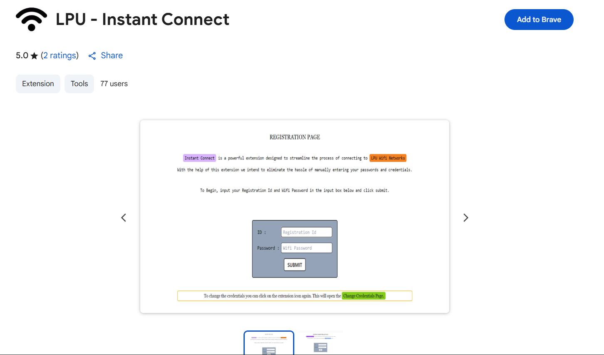

# LPU - Instant Connect Chrome Extension

> **The fastest way to connect to LPU Wi-Fi.**

---

## Overview

**LPU - Instant Connect** is a productivity-focused Chrome Extension designed to eliminate the tedious, manual process of logging into the **LPU Wi-Fi captive portal**.

Manually connecting can take between 5 to 8 seconds. This extension automates the entire sequence, completing the login in an average of **less than 0.4 seconds**—saving you time and frustration every time you connect!

---

## Key Features

* **Instant Login:** Dramatically reduces the time spent on the captive portal login.
* **Set and Forget:** Store your credentials securely and let the extension handle the rest.
* **Error Detection:** Detects error in the login credential to not overload the LPU wifi servers.
* **Version 2.0 Updates (NEW):**
    * **Comprehensive URL Coverage:** All known LPU captive portal URLs have been added, ensuring reliable connection across various networks on campus.
    * **Optimized Performance:** Significant reduction in the extension's file size for quicker downloads and a lighter footprint on your browser.

---

## Installation & Setup

### A. Install from Chrome Web Store (Recommended)

The easiest way to install the extension is directly from the official store:

1.  Visit the **[LPU - Instant Connect](https://chromewebstore.google.com/detail/lpu-instant-connect/pkjmmknbbgomeoihdjbakahebhkkepgg)** page.
2.  Click the **"Add to Chrome"** button.
3.  Pin the extension icon to your toolbar for easy access!

### B. Manual Installation (For Developers)

If you've downloaded the source code, you can install it as an unpacked extension:

1.  Download the repository as a ZIP file and unzip it, or clone the repository.
2.  Open Chrome and navigate to `chrome://extensions`.
3.  Enable **Developer mode** using the toggle switch in the top right corner.
4.  Click **"Load unpacked"** and select the root directory of this repository (`Instant-Connect-Chrome-Extension`).

---

## How to Use

1.  **Click the Extension Icon** (usually a lightning bolt or similar). This opens the main `popup/` interface.
2.  **Enter Your LPU Credentials:** Input your UMS ID and password in the respective fields. These are saved securely within your browser's local storage for instant future use.
3.  **Connect!** The extension will automatically detect the captive portal page and execute the login script using your stored credentials.

---

## Project Structure

The repository is structured as a standard Chrome Extension:

| Folder/File | Purpose |
| :--- | :--- |
| `popup/` | The HTML, CSS, and JS for the user interface that appears when you click the extension icon. |
| `background/` | Handles persistent events and logic that runs in the background. |
| `content/` | Scripts injected into the LPU captive portal page to automate the login. |
| `icons/` | Contains the extension icons in various sizes. |
| `manifest.json` | The required metadata file that defines the extension's properties, permissions, and scripts. |
| `screenshot.png` | The primary image showcasing the extension. |
| `input.css`, `output.css`, `tailwind.config.js` | Styling and build files (likely for Tailwind CSS). |

---

## Support & Feedback

Encountered an issue or have a suggestion? Please feel free to open a detailed **[Issue](https://github.com/Ma-gi-cian/Instant-Connect-Chrome-Extension/issues)** in this repository!
